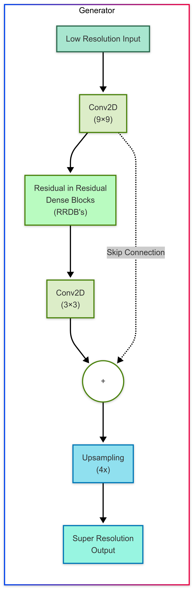
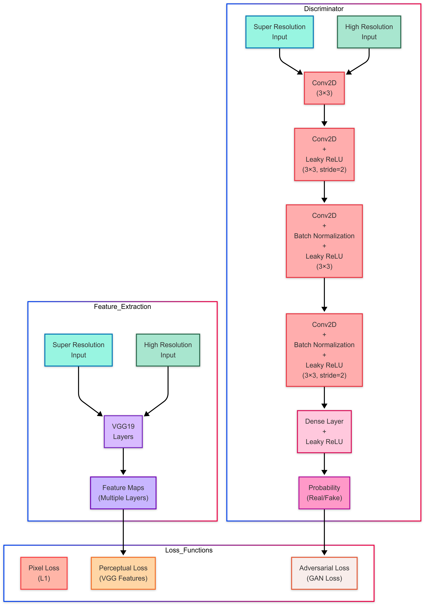
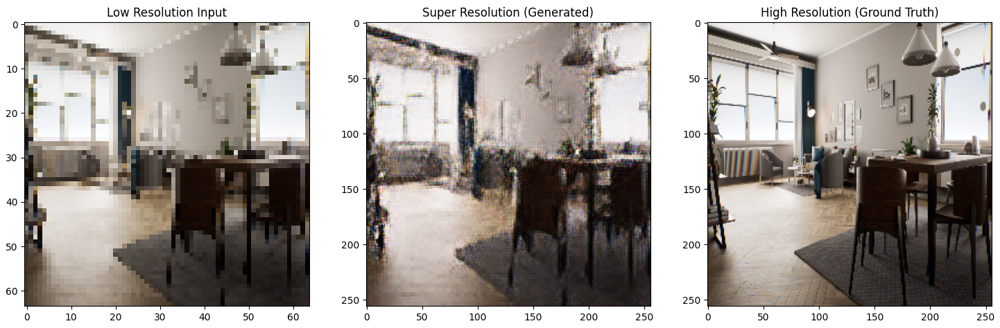
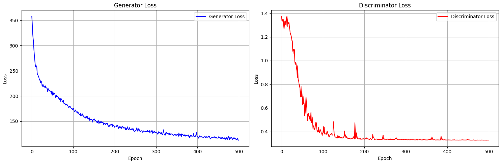
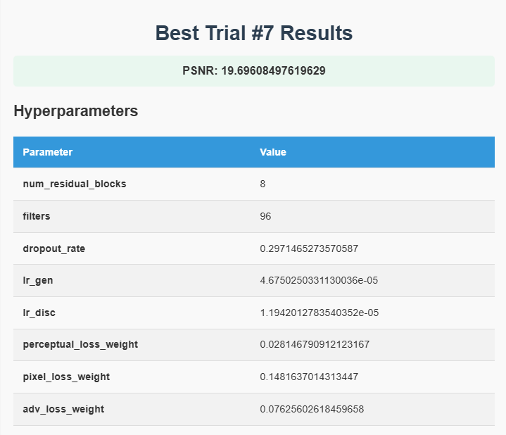
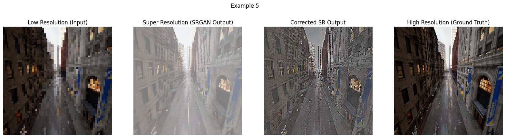
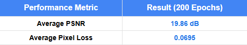

# Super-Resolution GAN Training Pipeline with Optuna Tuning

This repository contains a streamlined, modular pipeline for training a Super-Resolution Generative Adversarial Network (SRGAN) with **Optuna** hyperparameter optimization support.  
It is designed to be run on an **HPC cluster** with **SLURM** for job scheduling, but can also be adapted to local machines.

---

## Features
- **SRGAN Architecture**: Generator and Discriminator based on residual learning and adversarial loss.
- **Perceptual Loss**: Incorporates VGG19 feature-based perceptual loss alongside pixel and adversarial loss.
- **Optuna Hyperparameter Tuning**: Automated tuning of generator/discriminator learning rates, residual block counts, loss weights, and dropout.
- **Checkpointing**: Generator models are saved after every epoch and at the end of training.
- **Evaluation**: Visual comparison of Low-Res, SRGAN Output, Corrected SRGAN Output, and Ground-Truth High-Res images.
- **Dataset Management**: Supports organized datasets with `training-lr`, `training-hr`, `validation-lr`, `validation-hr`, `test-lr`, and `test-hr` folders.
- **SLURM Compatibility**: Scripts are lightweight and can be easily wrapped into SLURM batch jobs. Example SLURM scripts are provided in example_slurm_train.sh and example_slurm_optuna.sh

---

## 🏗️ Model Architecture
---
### Generator Structure
The Generator network is based on deep residual learning with skip connections to enhance fine detail recovery.
<div align="center">

</div>

### Discriminator Structure
The Discriminator network classifies between real and generated images using stacked convolutional layers followed by dense layers.

<div align="center">

</div>

## Repository Structure
```
├── gan_model.py          # SRGAN Generator and Discriminator architectures, training loop
├── vgg_loss_utils.py     # VGG19-based perceptual loss functions
├── train_srgan.py        # Main script for training SRGAN (with/without best Optuna parameters)
├── optuna_tuner_full.py  # Hyperparameter tuning using Optuna
├── evaluate_srgan.py     # Visualization and evaluation of trained models
├── checkpoints/          # Saved models from training
├── optuna_trials/        # Logs and best parameters from Optuna tuning
└── README_SRGAN.md       # Project overview and instructions
```
## Installation

```bash
pip install tensorflow opencv-python optuna matplotlib numpy
```

---

## Dataset Structure

```
/path/to/dataset/
    ├── training-lr/
    ├── training-hr/
    ├── validation-lr/
    ├── validation-hr/
    ├── test-lr/
    └── test-hr/
```

---

## Quick Usage

**Train SRGAN:**

```bash
python train_srgan.py --epochs 50 --steps_per_epoch 1000
```

**Hyperparameter tuning:**

```bash
python optuna_tuner_full.py
```

**Evaluate model:**

```bash
python evaluate_srgan.py --generator_path /path/to/model.h5 --data_dir /path/to/dataset
```
**Evaluate model:**
```bash
python evaluate_srgan.py --generator_path /path/to/model.h5 --data_dir /path/to/dataset
```
---

# 📈 Results

## Baseline SRGAN Training
- **Epochs**: 500
- **Observations**:
  - No weight initialization led to slow convergence.
  - Generator outputs appeared **lighter** than the ground truth images.

### 📷 Example: Baseline Outputs


---

## Final SRGAN with Optuna Tuning
<table>
  <tr>
    <td>
<ul>
<li><strong>Trials</strong>: 10 Optuna trials</li>
<li><strong>Best Trial</strong>: Trial #7</li>
<li><strong>Best PSNR</strong>: 19.70 dB</li>
<li><strong>Architecture</strong>: 8 residual blocks, 96 filters, dropout rate of 0.297</li>
<li><strong>Post-processing</strong>: Color correction applied after upscaling</li>
</ul>
    </td>
    <td align="center">
      
    </td>
  </tr>
</table>


### 📷 Example: Final Outputs

- *(SRGAN output appears brighter compared to the input and ground-truth HR images.)*
- *(Noticeable improvements in detail and color after post-processing and tuning.)*

### Results Final


---

# 🎯 Learnings and Insights
- Weight initialization significantly affects GAN training stability and convergence speed.
- Color correction can noticeably improve perceived output quality.
- Optuna tuning helped balance model complexity and performance.
- Future improvements could include expanding the generator to ESRGAN architecture (+ more residual blocks).
---

## Acknowledgements

- [Ledig et al., "Photo-Realistic Single Image Super-Resolution Using a Generative Adversarial Network", CVPR 2017](https://arxiv.org/abs/1609.04802)
- [Optuna: A Hyperparameter Optimization Framework](https://optuna.org/)
- TensorFlow/Keras framework for deep learning models
